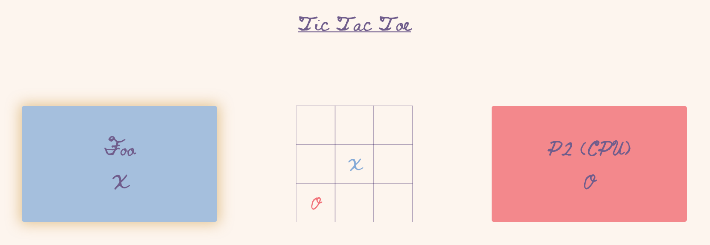

# Tic Tac Toe
2-player tic-tac-toe made as part of [The Odin
Project's JavaScript
course](https://www.theodinproject.com/courses/javascript/lessons/tic-tac-toe-javascript).
I used the module pattern and factory functions to practice
them, as they were introduced in the previous lesson.

## Usage

- Visit [the game's page](https://lukylurks.github.io/tic-tac-toe/)
- Enter names if you want, select the game mode, and hit "New Game" to start
  playing. If you choose 2 players, just take turns clicking.

## Structure

The project follows the structure explained in [this MDN
article](https://developer.mozilla.org/en-US/docs/Learn/Getting_started_with_the_web/Dealing_with_files).
- [scripts/main.js](./scripts/main.js): the game script. It's made of 3 main
  parts:
	* the `board` object, which contains all the methods to set, read, and modify
	  the state of the board
	* the `ui` object, which will trigger those functions in response to user
	  input on the DOM, then update the DOM
	* the `game` object, which controls the order in which it all happens 
- [styles](./styles/): [Eric Mayer's CSS
  reset](https://meyerweb.com/eric/tools/css/reset/) and my own CSS
- [index.html](./index.html): all the HTML code

## License

This project is licensed under the [MIT license](./LICENSE).
